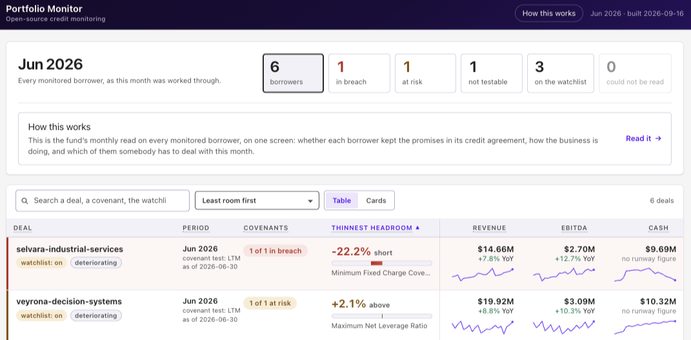
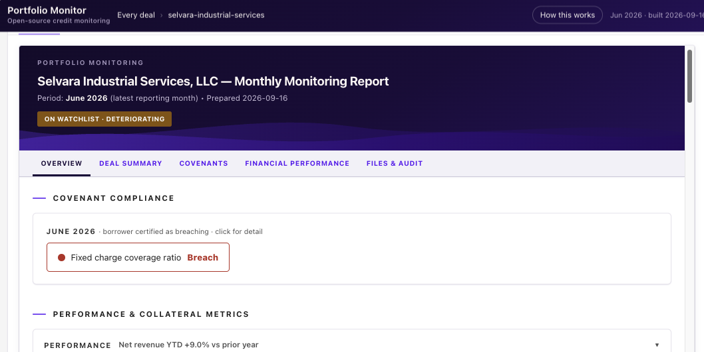
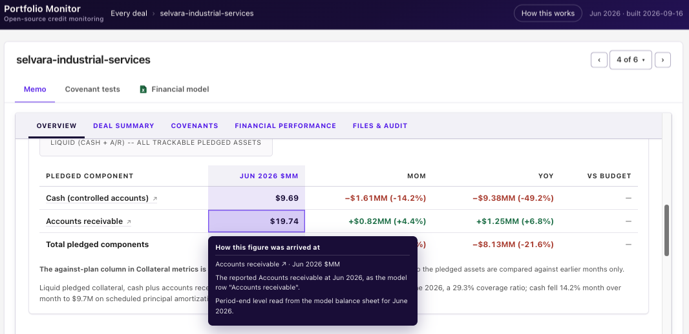
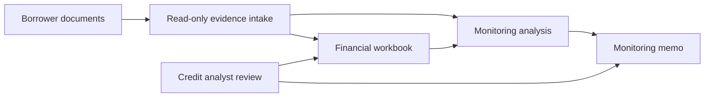
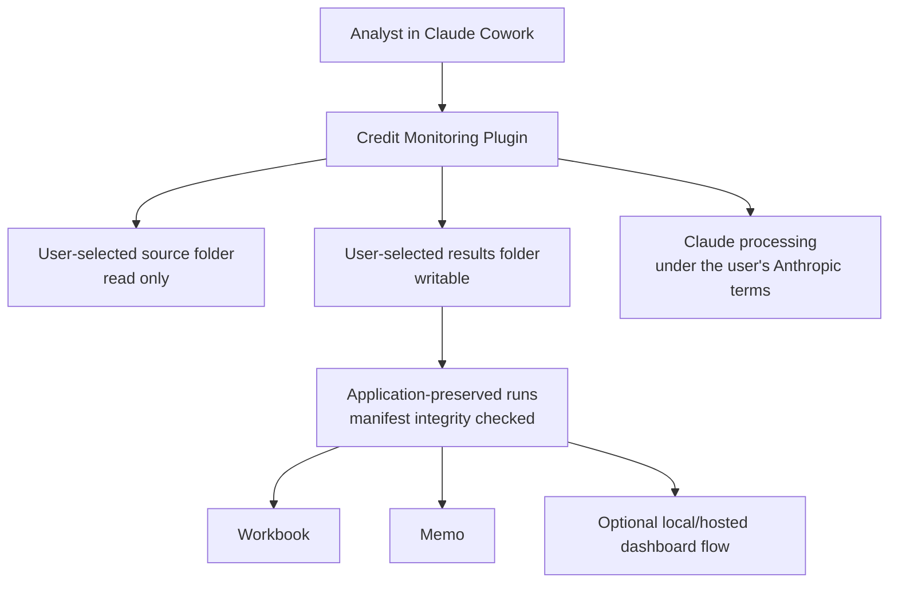

<a href="https://100xpartners.ai">
  <picture>
    <source media="(prefers-color-scheme: dark)" srcset="docs/assets/100xpartners-logo-dark.png">
    
  </picture>
</a>

<h3></h3>

# Credit Monitoring Plugin

> Built by 100x Partners — [100xpartners.ai](https://100xpartners.ai)


[](https://github.com/100xopensource/100x-credit-monitoring/actions/workflows/validate.yml)
[](https://github.com/100xopensource/100x-credit-monitoring/releases/latest)
[](LICENSE)

**AI-assisted private-credit monitoring for credit professionals using Claude Cowork.**

Turn borrower reporting and loan documents into a structured financial workbook and a review-ready monitoring memo. The plugin helps organize evidence and analysis; the credit analyst remains responsible for reviewing every result and making every credit decision.


## See a completed review first

Explore six fictional borrowers' June 2026 workbooks, memos, and portfolio dashboard before running anything. **No plugin installation is needed to view the files.** These are downloadable outputs, separate from the illustrative screenshots below.

**[View live sample](https://100xpartners.ai/credit-monitoring/)** · **[Download sample results](sample-output/README.md#1-view-sample-results)** · **[Continue from the sample — compatibility notes](sample-output/README.md#2-continue-from-the-sample)** · **[Run the sample yourself](sample-output/README.md#3-run-the-sample-yourself)**

The [sample guide](sample-output/README.md) includes the complete ZIP and dashboard download. Saved-store continuation is blocked by the current candidate's folder validator; the reports remain independently viewable. Running a fresh review takes the normal time.

## What it looks like

Screenshots of the [live sample](https://100xpartners.ai/credit-monitoring/) — six borrowers' June 2026 reviews, as the plugin produced them.

**The portfolio, thinnest headroom first.** Every monitored borrower on one screen: who is in breach, who is close to one, who could not be tested, and how revenue, EBITDA, and cash have moved.



**One borrower's monitoring memo.** Covenant compliance, performance and collateral metrics, deal summary, financial performance, and the files behind them — each on its own tab.



**Every covenant tested, with the arithmetic shown.** Required against actual, the headroom between them, the basis the test runs on, and how the borrower's own compliance certificate compares.


**Any figure traces back to where it came from.** Hover a number and the memo says which model row, which period, and which document it was read from — so a reviewer can check a figure without rebuilding it.



The borrowers, figures, and documents shown are synthetic. Nothing above is a real company or a real credit.

## What it produces

| Output | Purpose |
|---|---|
|  | **Financial workbook** — monthly history, supporting schedules, and monitoring calculations. |
|  | **Monitoring memo** — performance, liquidity, covenants, risks, evidence, and missing information. |

Each review produces exactly these two. The optional portfolio dashboard is a separate combined view of reviews you have already finished, not a third output.

You can create a dashboard privately, open it again later, and ask whether it is still up to date. Updating one at the same link is not supported in v1 — create a new one instead. See [the portfolio dashboard](#advanced-the-portfolio-dashboard) for how. Full detail in [Limitations](docs/LIMITATIONS.md).

## Before you start

1. **Open Claude in Cowork.**
   The review uses three background agents and won't run in a regular chat.
2. **Put one borrower's documents in a single folder.**
   Include the reporting package and signed loan documents. You can also use the sample data below.
3. **Have Excel and a browser ready.**
   You'll use them to open the generated workbook and memo.

Nothing else to install.

## Install

1. In Claude Cowork, open **Customize → Plugins**.
2. Select **Add**, then **Add marketplace**.
3. Paste `https://github.com/100xopensource/100x-credit-monitoring`.
4. Pick **Credit Monitoring** from the list and install it.

## Start your first review

Start a new chat and say **"credit monitoring"**. Then either:

- **Explore the completed sample first.** Follow [View sample results](sample-output/README.md) for the dashboard and actual workbooks/memos. No review starts just to view them. The same guide explains saved-state limitations and running the [source dataset](https://github.com/100xopensource/100x-credit-monitoring-synthetic-dataset) from scratch.
- **Use your own borrower.** Say **"Run credit monitoring for [borrower name]"** and point Claude at that borrower's folder.

Claude asks for the read-only borrower source folder first, then a separate writable results folder. A first setup can take an hour or more for document-heavy borrowers; Claude reports progress and supports pause and resume.

See [Getting started](docs/GETTING_STARTED.md) for the full walkthrough, and the packaged [illustrated folder guide](plugins/credit-monitoring/references/getting-your-folders-ready.html) for Local, OneDrive/SharePoint, and Google Drive desktop folders.

## Advanced: the portfolio dashboard

Once you have completed reviews, the plugin can combine them into one private dashboard — a single view across several borrowers, built from memos you have already accepted. It assembles verified results; it recalculates nothing.

You need at least one saved review before this will work.

| Say this | What happens |
|---|---|
| **"Create my portfolio dashboard"** | Claude lists which borrowers will appear, then asks permission before creating a private dashboard. Nothing is shared automatically. |
| **"Open my portfolio dashboard"** | Reopens the existing one. Opening it is not proof that it matches your local results. |
| **"Is my portfolio dashboard current?"** | Checks whether the local candidate still matches the dashboard you created. |
| **"Show me how to share the dashboard"** | Points you at Claude's own Share control. The plugin never changes permissions itself. |

Two skills sit behind this: `refresh-dashboard` rebuilds the local portfolio pages from verified saved runs, and `portfolio-artifact` creates, reopens, and checks the hosted copy.

**Updating one at the same link is not supported in v1.** Create a new dashboard instead. A local refresh rebuilds your local pages but does not touch an existing hosted dashboard.

Full walkthrough in [Getting started](docs/GETTING_STARTED.md#optional-portfolio-dashboard).

## Repository layout

```text
.claude-plugin/marketplace.json   the catalog Add marketplace reads
plugins/credit-monitoring/        the plugin itself: skills, agents, references
credit-monitoring.plugin          the packaged plugin, shipped with each release
docs/                             getting started, how it works, limitations
sample-output/                    completed example, dashboard, reports and saved state
```

## Workflow



## Architecture



## Privacy and responsibility

This is a **local-file workflow**, not a claim of local-only processing. The plugin reads user-selected files and stores results in a user-selected local or synced folder. Document content processed by Claude is handled under the user's Anthropic terms and settings. Creating a hosted Claude dashboard is a separate, explicit action; nothing is shared automatically.

Completed reviews are application-preserved and manifest integrity-checked before reuse, not filesystem-immutable. They remain ordinary writable files: users, sync clients, or other software can alter or delete them, after which verification will fail.

The plugin does not replace professional judgment. Verify source evidence, formulas, covenant definitions, exceptions, and conclusions before relying on an output. See [Security and privacy](docs/SECURITY_AND_PRIVACY.md) and [Limitations](docs/LIMITATIONS.md).

## Repository guide

- [Getting started](docs/GETTING_STARTED.md)
- [How it works](docs/HOW_IT_WORKS.md)
- [Security and privacy](docs/SECURITY_AND_PRIVACY.md)
- [Limitations](docs/LIMITATIONS.md)
- [Contributing](CONTRIBUTING.md)
- [Support](SUPPORT.md)
- [Security policy](SECURITY.md)
- [Code of conduct](CODE_OF_CONDUCT.md)
- [Changelog](CHANGELOG.md)
- [Build and validation](CONTRIBUTING.md#build-and-validate)

## Licensing

- This repository, including the packaged plugin, is licensed under [Apache-2.0](LICENSE). See [NOTICE](NOTICE) for the attribution notice that must be kept in any copy.
- `openpyxl` is a runtime dependency installed from PyPI under the MIT licence. It is not redistributed here.
- Apache-2.0 grants no trademark rights. You may fork and redistribute the code; you may not use the 100x name or marks to describe your fork or imply that 100x produced it.
- Contributions are accepted under Apache-2.0 with a Developer Certificate of Origin sign-off. See [CONTRIBUTING.md](CONTRIBUTING.md).
