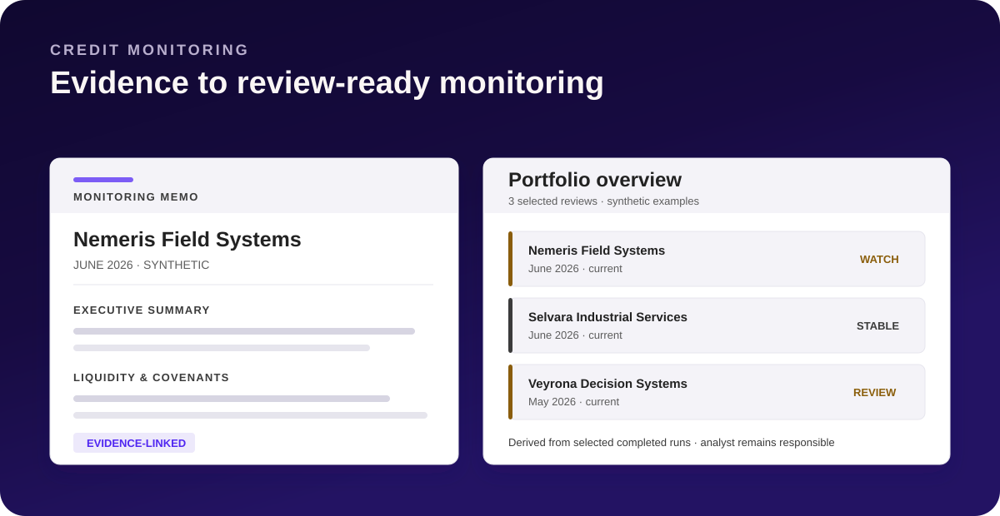
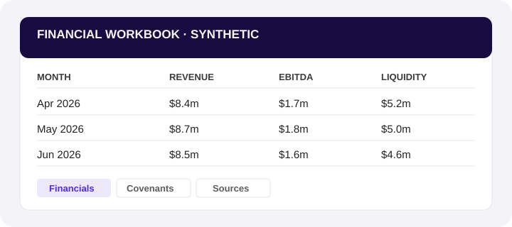
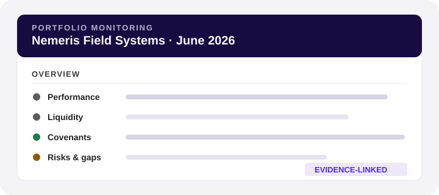
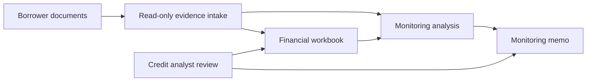
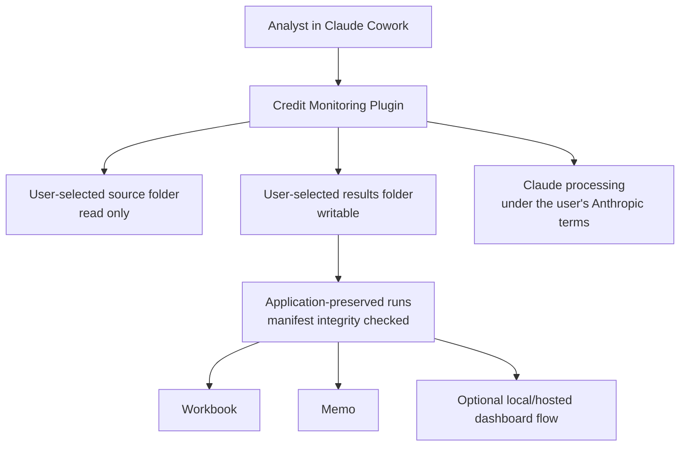

<a href="https://100xpartners.ai">
  <picture>
    <source media="(prefers-color-scheme: dark)" srcset="docs/assets/100xpartners-logo-dark.png">
    
  </picture>
</a>

<h3></h3>

# Credit Monitoring Plugin

> Built by 100x Partners — [100xpartners.ai](https://100xpartners.ai)

[](https://github.com/100xopensource/100x-credit-monitoring/actions/workflows/validate.yml)
[](https://github.com/100xopensource/100x-credit-monitoring/releases/latest)
[](LICENSE)

**AI-assisted private-credit monitoring for credit professionals using Claude Cowork.**

Turn borrower reporting and loan documents into a structured financial workbook and a review-ready monitoring memo. The plugin helps organize evidence and analysis; the credit analyst remains responsible for reviewing every result and making every credit decision.



## What it produces

| Output | Purpose |
|---|---|
|  | **Financial workbook** — monthly history, supporting schedules, and monitoring calculations. |
|  | **Monitoring memo** — performance, liquidity, covenants, risks, evidence, and missing information. |

Each review produces exactly these two. The optional portfolio dashboard is a separate combined view of reviews you have already finished, not a third output.

You can create a dashboard privately, open it again later, and ask whether it is still up to date. Updating one at the same link is not supported in v1 — create a new one instead. Full detail in [Limitations](docs/LIMITATIONS.md).

## Before you start

1. **Open Claude in Cowork.**
   The review uses three background agents and won't run in a regular chat.
2. **Put one borrower's documents in a single folder.**
   Include the reporting package and signed loan documents. You can also use the sample data below.
3. **Have Excel and a browser ready.**
   You'll use them to open the generated workbook and memo.

Nothing else to install.

## Install

1. In Claude Cowork, open **Customize → Plugins**.
2. Select **Add**, then **Add marketplace**.
3. Paste `https://github.com/100xopensource/100x-credit-monitoring`.
4. Pick **Credit Monitoring** from the list and install it.

## Start your first review

Start a new chat and say **"credit monitoring"**. Then either:

- **Try the sample data first.** Download the [synthetic dataset](https://github.com/100xopensource/100x-credit-monitoring-synthetic-dataset) — fictional borrowers, no real company data — and point Claude at one of its borrower folders.
- **Use your own borrower.** Say **"Run credit monitoring for [borrower name]"** and point Claude at that borrower's folder.

Claude asks for the read-only borrower source folder first, then a separate writable results folder. A first setup can take an hour or more for document-heavy borrowers; Claude reports progress and supports pause and resume.

See [Getting started](docs/GETTING_STARTED.md) for the full walkthrough, and the packaged [illustrated folder guide](plugins/credit-monitoring/references/getting-your-folders-ready.html) for Local, OneDrive/SharePoint, and Google Drive desktop folders.

## Repository layout

```text
.claude-plugin/marketplace.json   the catalog Add marketplace reads
plugins/credit-monitoring/        the plugin itself: skills, agents, references
credit-monitoring.plugin          the packaged plugin, shipped with each release
docs/                             getting started, how it works, limitations
```

## Workflow



## Architecture



## Privacy and responsibility

This is a **local-file workflow**, not a claim of local-only processing. The plugin reads user-selected files and stores results in a user-selected local or synced folder. Document content processed by Claude is handled under the user's Anthropic terms and settings. Creating a hosted Claude dashboard is a separate, explicit action; nothing is shared automatically.

Completed reviews are application-preserved and manifest integrity-checked before reuse, not filesystem-immutable. They remain ordinary writable files: users, sync clients, or other software can alter or delete them, after which verification will fail.

The plugin does not replace professional judgment. Verify source evidence, formulas, covenant definitions, exceptions, and conclusions before relying on an output. See [Security and privacy](docs/SECURITY_AND_PRIVACY.md) and [Limitations](docs/LIMITATIONS.md).

## Repository guide

- [Getting started](docs/GETTING_STARTED.md)
- [How it works](docs/HOW_IT_WORKS.md)
- [Security and privacy](docs/SECURITY_AND_PRIVACY.md)
- [Limitations](docs/LIMITATIONS.md)
- [Contributing](CONTRIBUTING.md)
- [Support](SUPPORT.md)
- [Security policy](SECURITY.md)
- [Code of conduct](CODE_OF_CONDUCT.md)
- [Changelog](CHANGELOG.md)
- [Build and validation](CONTRIBUTING.md#build-and-validate)

## Licensing

- This repository, including the packaged plugin, is licensed under [Apache-2.0](LICENSE). See [NOTICE](NOTICE) for the attribution notice that must be kept in any copy.
- `openpyxl` is a runtime dependency installed from PyPI under the MIT licence. It is not redistributed here.
- Apache-2.0 grants no trademark rights. You may fork and redistribute the code; you may not use the 100x name or marks to describe your fork or imply that 100x produced it.
- Contributions are accepted under Apache-2.0 with a Developer Certificate of Origin sign-off. See [CONTRIBUTING.md](CONTRIBUTING.md).
