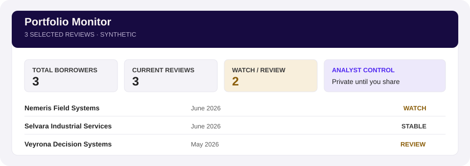

# Getting started

## What you need

- Claude Cowork. Reviews run three background agents, which do not run in a plain chat.
- One borrower folder containing reporting and signed loan documents, or the [synthetic dataset](https://github.com/100xopensource/100x-credit-monitoring-synthetic-dataset).
- A separate writable results folder.
- Excel and a browser, to open the workbook and the memo.

Budgets, compliance certificates, aging reports, and underwriting material improve the review but are optional. Missing evidence is reported rather than invented.

## Install

1. Open Claude Cowork.
2. Select **Customize → Plugins**.
3. Select **Add**, then **Add marketplace**.
4. Paste `https://github.com/100xopensource/100x-credit-monitoring`.
5. Pick **Credit Monitoring** from the list and install it.

## Start your first review

Start a new chat and say **“credit monitoring.”** To review your own borrower directly, say **“Run credit monitoring for [borrower name].”**

## Choose folders

Claude requests these in order:

1. **Borrower source folder:** read only; the plugin must not modify it.
2. **Results folder:** writable and separate from the source. Select the parent folder, not a manually created `credit-monitoring-output` child.

Local folders are simplest. Existing OneDrive, SharePoint, and Google Drive desktop folders also work when their files are available on the computer. Open the packaged [`getting-your-folders-ready.html`](../plugins/credit-monitoring/references/getting-your-folders-ready.html) guide for illustrated steps; no external website is required.

## Complete the first review

Claude reads the evidence, confirms borrower-specific decisions it cannot safely infer, builds the workbook, performs the monthly review, and renders the memo. Keep Cowork open while it works. A first setup can take an hour or more.

Success means:

- one financial workbook opens normally;
- one monitoring memo opens normally;
- both are saved under the chosen output folder;
- the source folder is unchanged;
- missing evidence and unresolved decisions are visible.

## Review and confirm the draft

The completed workbook and memo are a **draft**, not an accepted result. Ask Claude to accept or discard that exact draft after reviewing it. Discard keeps the saved history and restores the accepted working files; the first review cannot be discarded because there is no accepted result to restore. Newer manual edits block replacement.

To incorporate workbook edits, ask Claude to review them and produce a new draft. It checks the exact reviewed file and recomputes the analysis and memo. Memo edit intake is not supported; preserve those edits and resolve them before continuing. Never edit internal records to bypass a warning.

This release creates new-format stores only. Older stores are left unchanged, not converted. If recovery reports a damaged saved run, keep the files and ask for help rather than deleting its records.

## Optional portfolio dashboard

After one or more completed reviews are selected as current, ask **“Create my portfolio dashboard.”** Claude explains which borrowers will appear before requesting permission to create a private hosted dashboard. You can later open it or ask whether the local candidate is current.

The dashboard distinguishes accepted results from the visible draft and prior accepted periods. Creating a hosted dashboard includes those views; refreshing local pages does not update an existing hosted dashboard. Same-link updates are not supported in v1; the existing hosted copy stays unchanged. Opening it is not proof that it matches local results.

## Finance guidance

The interactive crash course is unavailable in v1. Ask Claude a finance question directly and consult this repository's [How it works](HOW_IT_WORKS.md) and [Limitations](LIMITATIONS.md) guidance. Monitoring does not depend on the course.
